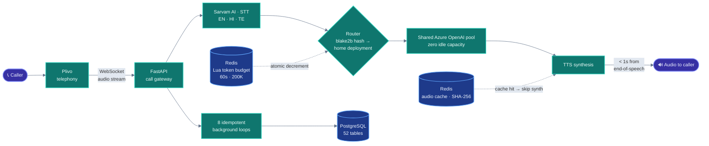
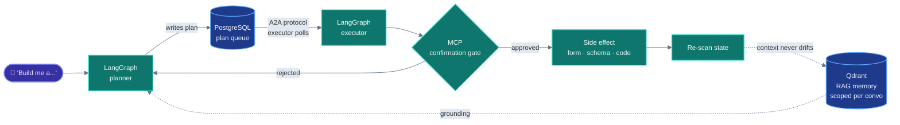

<div align="center">
  
</div>

<div align="center">

<a href="https://www.linkedin.com/in/nihar-neelala/"></a>
<a href="mailto:Niharkumar1407@gmail.com"></a>
<a href="https://learn.microsoft.com/en-us/users/NeelalaHarishNiharKumar-7058/credentials/D87B6A9D53F4D641"></a>


</div>

<br />

<div align="center">
  <h3>I build AI systems that survive contact with production.</h3>
  <p><i>Not demos. Not notebooks. Live traffic, real money, real latency budgets.</i></p>
</div>

<br />

Most people wire an LLM to an API and call it a system. I build the parts that make it hold: the token-budgeted model pool that keeps idle spend at zero, the routing hash that keeps a prompt cache warm across a phone conversation, the advisory locks that stop eight replicas from buying the same phone number twice.

**125,000+ lines of Python across four systems — architected and written solo.** The flagship answers real phone calls in three languages, in under a second.

---

## ⚙️ Arsenal

<div align="center">

**Core**


**AI & Agents**


**Backend & Data**


**Ship it**


</div>

---

## `whoami`

```python
class Engineer:
    name    = "Nihar Neelala"                # Neelala Harish Nihar Kumar
    title   = "AI Systems Engineer"          # backend-heavy, latency-obsessed
    base    = "Hyderabad, India 🇮🇳"
    school  = "B.Tech CSE @ GITAM — Class of 2027"

    domain  = ["real-time voice AI", "agent architecture", "distributed systems"]
    weapons = ["Python", "FastAPI", "PostgreSQL", "Redis", "Azure", "LangGraph"]
    speaks  = ["English", "Telugu", "Hindi"]     # so do the agents I ship

    def how_i_work(self):
        yield "read the docs, then read the source"
        yield "map the failure modes before writing the happy path"
        yield "fail-open for background work, fail-closed for money"
        yield "if it isn't measured, it isn't fast"
```

---

## 📐 By the numbers

<div align="center">

| Python shipped | Endpoints designed | Tables modelled | Automated tests | Agent nodes |
|:---:|:---:|:---:|:---:|:---:|
| **125,500** | **341** | **82 + 24** | **1,466** | **26** |
| across 4 systems | REST · WebSocket | relational · document | on every deploy | LangGraph |

</div>

<div align="center">
<sub>Across NOKVO · Hydie · Agentic Form Generator · Needles — plus 7,100 lines of JavaScript.</sub>
</div>

---

## 🧠 The hard parts

> The interesting engineering isn't in the feature list. It's here.

<table>
<tr><td width="33%"><b>💸 Idle reserved capacity → zero</b></td><td>

Per-tenant Azure OpenAI provisioning meant every customer reserved capacity they weren't using. I replaced it with **one shared, budgeted pool** — atomic **Lua decrements** over rolling 60-second / 200,000-token windows in Redis. Multi-tenant isolation without multi-tenant waste.

</td></tr>
<tr><td><b>⚡ Keeping a cache warm mid-conversation</b></td><td>

Round-robin routing cold-starts the prompt cache on every turn — brutal for latency. Each call now anchors to a **home deployment via `blake2b` hashing**, so Azure's cache stays warm across the whole conversation. Rate-limited model? Rerouted in **milliseconds**, no dropped audio.

</td></tr>
<tr><td><b>🎙️ Sub-second, in three languages</b></td><td>

End-of-speech to first audio stays **under 1 second** in English, Hindi and Telugu on live calls. Synthesised audio is cached in Redis under a **SHA-256 of the request**; campaign scripts are **pre-translated into all three languages at creation time**, not per call.

</td></tr>
<tr><td><b>🔒 Eight replicas, one phone number</b></td><td>

Paid telephony numbers cannot be bought twice. The entire Indian DID lifecycle — compliance filing, approval polling, rental, rotation — runs unattended behind **Redis single-flight locks** and **PostgreSQL advisory locks**, so concurrent replicas never double-spend.

</td></tr>
<tr><td><b>🛡️ 82 failure modes, mapped</b></td><td>

I catalogued **82 failure modes across 17 subsystems** before hardening. The result is a deliberate split: background loops **fail open** so a degraded dependency never stops a call, payments **fail closed** so a bad webhook signature never credits an account.

</td></tr>
<tr><td><b>🤖 Agents that can't hallucinate your schema</b></td><td>

Codegen agents drift because they guess at your tables. Mine **scan the live database, embed the real schema into Qdrant**, and gate every write behind an **MCP confirmation node** — then re-scan so context never falls out of sync with reality.

</td></tr>
</table>

---

## 🔊 NOKVO — production voice AI

<a href="https://github.com/NiharPy/NOKVO"></a>

**Voice agents that answer inbound calls and run outbound campaigns in English, Hindi and Telugu.** I architected and built the entire platform solo — 3 product surfaces, 273 REST and WebSocket endpoints, 52 PostgreSQL tables, a Vue 3 SPA, and **104,000 lines of Python**.



<table>
<tr>
<td width="50%">

**Infrastructure**
- Azure Container Apps + **Bicep IaC**
- Key Vault **managed identity** — no secrets in code
- GitHub Actions **OIDC** CI/CD
- **55** Alembic migrations · **1,466** automated tests
- OpenTelemetry + LangSmith tracing

</td>
<td width="50%">

**Commerce**
- Razorpay subscriptions, prepaid minute bundles, credits wallet
- **4 metered per-call cost centres**
- Webhook signature verification, **fail-closed**
- HMAC-signed CRM webhook delivery
- Idempotent retry on every money path

</td>
</tr>
</table>

<sub>`Python` · `FastAPI` · `PostgreSQL` · `SQLAlchemy` · `Alembic` · `Redis` · `Azure OpenAI` · `Container Apps` · `Key Vault` · `Bicep` · `Docker` · `Vue 3` · `Plivo` · `Sarvam AI` · `Razorpay` · `OpenTelemetry` · `LangSmith`</sub>

---

## 🤖 Agentic systems

Two systems that take a sentence and produce a real artifact — unattended, no human in the loop after the prompt.



<table>
<tr>
<td width="50%" valign="top">

### [Agentic Google Form Generator](https://github.com/NiharPy/Agentic-GoogleForm-Generator)
<sub>`Feb 2026` · FastAPI · LangGraph · A2A · Qdrant</sub>

**Prompt → a finished Google Form, built end to end unattended.**

- **6-node LangGraph** workflow splitting planner from executor
- Executor polls plans from Postgres over a **database-driven A2A protocol** — the two agents never call each other directly
- 10 endpoints, 7 tables, **4,500 lines** spanning **Azure + GCP**
- Google **OAuth 2.0**: forms land in *your* Drive, not a service account's
- RAG memory scoped to the conversation, not a global store

</td>
<td width="50%" valign="top">

### [Hydie — Agentic Backend Builder](https://github.com/NiharPy/Hydie)
<sub>`Jan – Feb 2026` · LangGraph · GPT-4o · MCP · Qdrant</sub>

**Prompt → working back-end code, scaffold through applied schema changes.**

- **20-node LangGraph** workflow inferring intent, delegating codegen to GPT-4o
- **17,000 lines** across 109 modules · 30 endpoints · 23 tables
- User DB credentials sealed in **Azure Key Vault**
- Live schema scanned + embedded into Qdrant so generation stays grounded in **real tables**
- Scaffold from zero, or import an existing repo via **GitHub OAuth**

</td>
</tr>
</table>

---

## 🧵 Earlier work

<table>
<tr>
<td width="60%" valign="top">

### [Needles — tailoring marketplace](https://github.com/NiharPy/needles-v1)
<sub>`Dec 2024 – Aug 2025` · [watch the demo ↗](https://drive.google.com/file/d/1QwREHyGly7MY-paOWP8kWdpl_0AdAGl2/view?usp=sharing)</sub>

Concept to working prototype in 9 months, setting technical direction for a 2-person team.

- **28 Express routes** over **24 MongoDB models** — 7,100 lines of JS, from scratch
- **Search a style by photo or description** using vector embeddings — replaced catalogue browsing entirely
- RBAC across customer / tailor / admin on one shared backend
- **Two clients, one API**: React Native for customers, Vue.js for tailors
- Analytics isolated into a standalone Flask service so reporting load never touched the transactional API

</td>
<td width="40%" valign="top">

### 🏅 Credentials

**Microsoft Certified**<br/>
<sub>Azure AI Fundamentals (AI-900)</sub>

**IELTS Academic — 7.0**<br/>
<sub>Speaking 7.5 · Listening 7.5</sub>

**B.Tech CSE, GITAM**<br/>
<sub>Class of 2027</sub>

### 🎯 Leading

- Team Lead — Final-Year Capstone `2026 –`
- Team Lead — Smart India Hackathon `2025`
- Finance Head — E-Sports Club `2025 – 26`

</td>
</tr>
</table>

---

## 📊 Telemetry

<div align="center">


</div>

---

<div align="center">

### Got a system that has to be fast, correct, and cheap — all three?

That's the problem I like.

<a href="mailto:Niharkumar1407@gmail.com"></a>
<a href="https://www.linkedin.com/in/nihar-neelala/"></a>

<br /><br />

<sub><i>fail-open for background work · fail-closed for money</i></sub>

</div>

